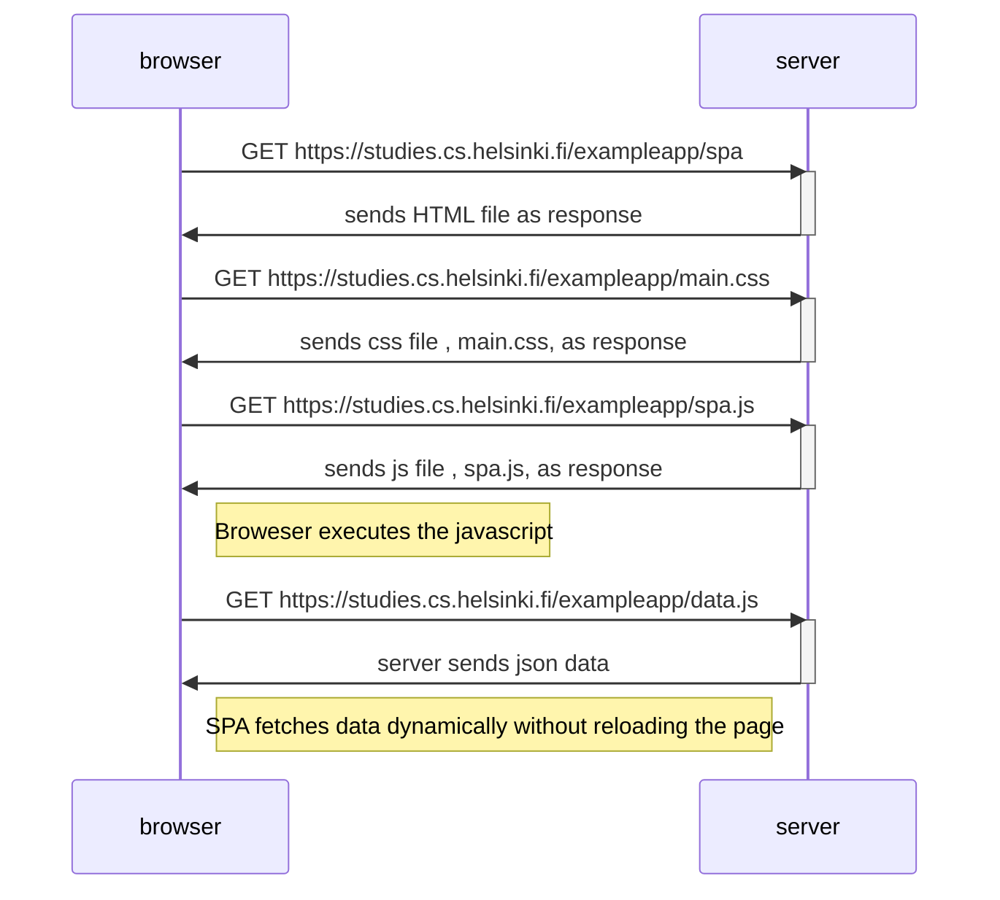

```mermaid
sequenceDiagram
    participant browser
    participant server

     browser->>server: GET https://studies.cs.helsinki.fi/exampleapp/spa
     activate server
     server ->>browser: sends HTML file as response
     deactivate server

     browser->>server: GET https://studies.cs.helsinki.fi/exampleapp/main.css
     activate server
     server ->>browser: sends css file , main.css, as response
     deactivate server

     browser->>server:GET https://studies.cs.helsinki.fi/exampleapp/spa.js
     activate server
     server ->>browser: sends js file , spa.js, as response
     deactivate server

     Note right of browser: Broweser executes the javascript

     browser->>server:GET https://studies.cs.helsinki.fi/exampleapp/data.js
     activate server
     server ->>browser: server sends json data
     deactivate server

     Note right of browser: SPA fetches data dynamically without reloading the page

```
